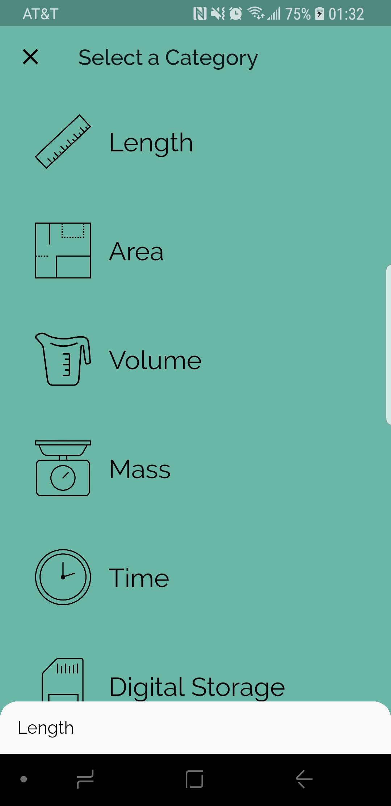
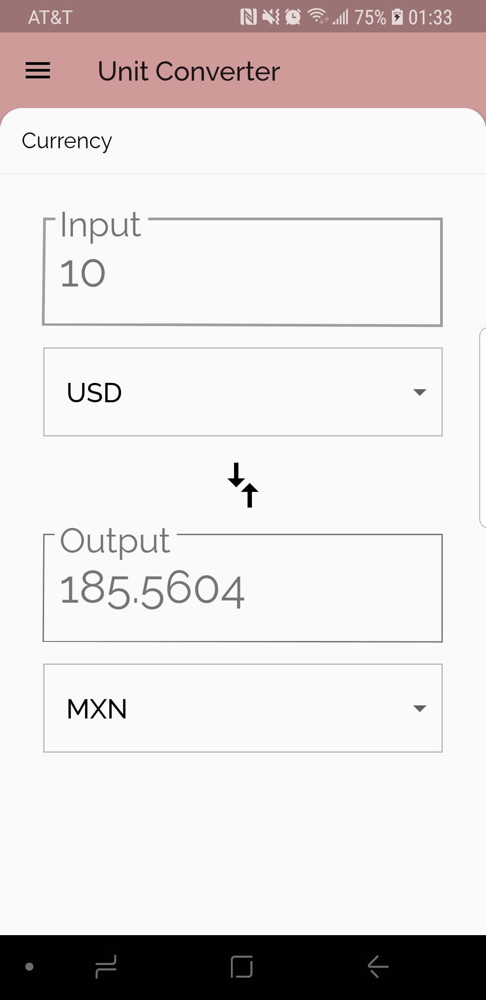

# Unit Converter App

This repository contains a complete working implementation of a unit converter app created as part of Udacity's [Build Native Mobile Apps with Flutter](https://www.udacity.com/course/build-native-mobile-apps-with-flutter--ud905) course. It was extended to include the following:

* File structure that separates `widgets`, `screens`, `model` and `infrastructure` classes.
* Use of a real [API](https://free.currencyconverterapi.com/) for live currency conversion rates.
* Unit and Widget testing.
* Driver tests (i.e. integration tests).
* Integration with Travis for Continuous Integration except driver tests which cannot be executed without an emulator.
* A custom app name and launcher icon.
* APK signing, minification and obfuscation for Android.

## Screenshots

[comment]: # (See: https://stackoverflow.com/questions/24319505/how-can-one-display-images-side-by-side-in-a-github-readme-md)

  
  
  

